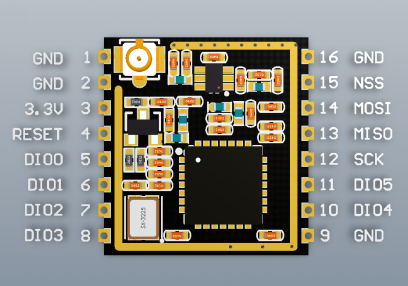

# About

This is documentation page for the Ai Thinker RA-01/02 LoRa RF module. 

# Resources 
 - [Ai Thinker LoRa Doc Page](https://docs.ai-thinker.com/en/lora/man)
   - [RA-02 Product Specification](docs/datasheet-LoRaModule-RA02-v1_1.pdf)
   - [SX1276/7/8/9 LoRa™ Chipset Datasheet](docs/Datasheet-SX1276-7-8-9_W_APP_V7.pdf)

# Overview

Anxinke LoRa series modules (Ra-01/Ra-02) are designed and developed by Anxinke Technology. The radio frequency chip of this series of modules **SX1278** mainly uses LoRa™ remote modem for ultra-long-distance spread spectrum communication. It has strong anti-interference and can Minimize current consumption. With the help of SEMTECH's LoRa™ patented modulation technology, SX1278 has a high sensitivity of over -148dBm, a power output of +20dBm, a long transmission distance and high reliability. At the same time, compared with traditional modulation technology, LoRa™ modulation technology also has obvious advantages in anti-blocking and selection, which solves the problem of distance, anti-interference and power consumption that traditional design solutions cannot simultaneously take into account.

## Ra-01/Ra-02 module characteristics

- LoRa™ modem
- Support FSK, GFSK, MSK, GMSK, **LoRa™** and OOK modulation methods
- Support frequency band **410MHz~525MHz**
- The working voltage is **3.3V** (Range: 2.7-3.6V), the maximum output is +20dBm, and the maximum working current is 105mA
- It has low power consumption characteristics in the receiving state, the receiving current is 12.15mA, the standby current is 1.6mA
- High sensitivity: as low as **-140dBm**
- Small size double row stamp hole patch package
- The module adopts **SPI interface**, half-duplex communication, with CRC, up to **256-byte packet engine**.
- Data rates up to **300 kBps**.

## Pin Function Definition

| **RA-01** | **RA-02** | **PIN NAME** | **DESCRIPTION** |
|--------|--------|--------|--------|
| 1 | - | ANT | Antenna    |
| 2 | 1,2 | GND | Ground    |
| 3 | 3 | 3.3V | 3.3V power supply  |
| 4 | 4 | RESET | Reset    |
| 5 | 5 | DIO0 | Dig-IO0 software config |
| 6 | 6 | DIO1 | Dig-IO1 software config |
| 7 | 7 | DIO2 | Dig-IO2 software config |
| 8 | 8 | DIO3 | Dig-IO3 software config |
| 9 | 9 | GND | Ground    |
| 10 | 10 | DIO4 | Dig-IO4 config |
| 11 | 11 | DIO5 | Dig-IO5 software config |
| 12 | 12 | SCK | SPI clock input  |
| 13 | 13 | MISO | SPI data output  |
| 14 | 14 | MOSI | SPI data input  |
| 15 | 15 | NSS | SPI chip select input |
| 16 | 16 | GND | Ground    |

## RX Sensitivity at 433 MHz

| Spread Factor | SNR (dB) | Sensitivity (dBm) |
|--------|--------|--------|
| 7 | -7 | -125 |
| 10 | -15 | -134 |
| 12 | -20 | -141 |

## RX Bandwidth Spread-Factor DataRate TradeOff

| SrNo | BW\SF | 6 | 7 | 8 | 9 |10 | 11 | 12 |
|----|----|----|----|----|----|----|----|----|
| 0 | 7.8khz | 585 bps | **341** | 195 | 109 | 60 | 52 | 18 |
| 1 | 10.4khz | 780 | 455 | **260** | 146 | 81 | 69 | 24 |
| 2 | 15.6khz | 1170 | 682 | 390 | 219 | 121 | 104 | 36 |
| 3 | 20.8khz | 1562 | 910 | 520 | **292** | 162 | 139 | 49 |
| 4 | 31.2khz | 2340 | 1365 | 780 | 438 | **243** | 209 | 73 |
| 5 | 41.6khz | 3120 | 1820 | 1040 | 585 | 325 | **279** | 97 |
| 6 | 62.5khz | 4688 | 2734 | 1562 | 878 | 488 | 419 | 146 |
| 7 | 125khz | 9380 | 5468 | 3125 | 1757 | 976 | 839 | **293** |
| 8 | 250khz | 18750 | 10937 | 6250 | 3515 | 1953 | 1678 | 585 |
| 9 | 500khz | 37500 | 21875 | 12500 | 7031 | 3906 | 3356 | 1171 |
